|PyVersion| |Status| |PyPiVersion| |License|

Introduction
============

The goal of HiFiScan is to help equalize an audio system to get
the best possible audio quality from it.
There are two ways to do this:

1. Manual: The realtime frequency spectrum is displayed and
the peaks and troughs can be interactively equalized away.

2. Automatic: The frequency response is measured and a correction
is calculated. This correction is a phase-neutral finite impulse
response (FIR) that can be imported into most equalizer programs.

The measuring is done by playing a "chirp" sound that sweeps
across all frequencies and recording how loud each frequency comes out
of the speakers. A good microphone is needed, with a wide frequency range
and preferably with a flat frequency response.

The equalization itself is not provided; It can be performed by an
equalizer of your choice, such as
`EasyEffects <https://github.com/wwmm/easyeffects/>`_
for Linux,
`Equalizer APO <https://sourceforge.net/projects/equalizerapo/>`_
and
`Peace <https://sourceforge.net/projects/peace-equalizer-apo-extension/>`_
for Windows, or
`eqMac <https://eqmac.app/>`_ for macOS.

Installation
============

::

    pip install -U hifiscan

The program is started from a console by typing::

    hifiscan

All functionality is also available for interactive use in
`this Jupyter notebook <chirp.ipynb>`_.

Examples
========

Laptop
------

Lets first optimize the speakers of a laptop.
The laptop has tiny down-firing speakers and a massive
case resonance that makes it sound about as bad as it gets.

The sound is recorded with a USB studio microphone; The built-in
microphone of the laptop is not suitable for this.

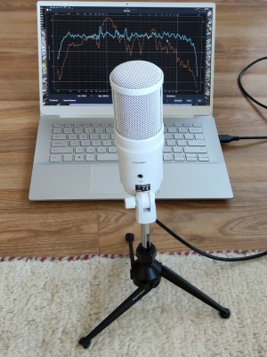

Letting the measurements run it becomes clear just how bad
the spectrum is, with a peak at 1 kHz about 20 dB above average.
Every 10 dB is a factor 10 in power, so 20 dB is a factor 100.

The low frequency is set to 200 Hz since the laptop can't possibly
output anything below this.

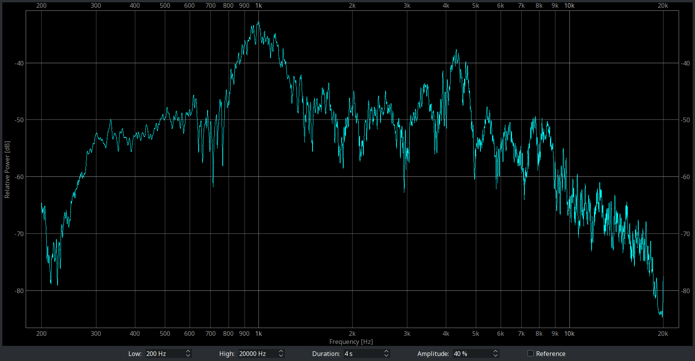

To get an automatic correction, we go to the "Impulse Response" section
(selectable in the lower left corner). From here it's possible to use
all-default values and click straight on "Export as WAV" to get a
perfectly adequate result.

But lets optimize a bit further for this laptop. There are various
tradeoffs that can be made, one of which involves the **Duration**
of the impulse. A longer duration gives better bass control,
but also adds more latency.
The latency added by the equalizer is halve the duration of the impulse.
Since the laptop has no bass anyway, we choose a 22 ms duration for a
super-low 11 ms latency. This is less time than it takes sound to travel
four meters and is good enough even for gaming or video-calls.

We also increase the **Range** to 27 dB to get just a little bit of
extra equalization.

The lower graph (in brown) shows how the equalized spectrum is expected
to be, and it looks nicely flattened.

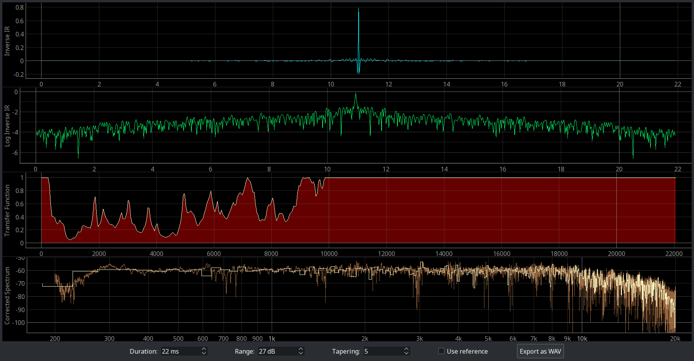

So lets export the impulse response and import
it into EasyEffects (In Convolver effect: "Impulses -> Import Impulse"
and then "Load"):

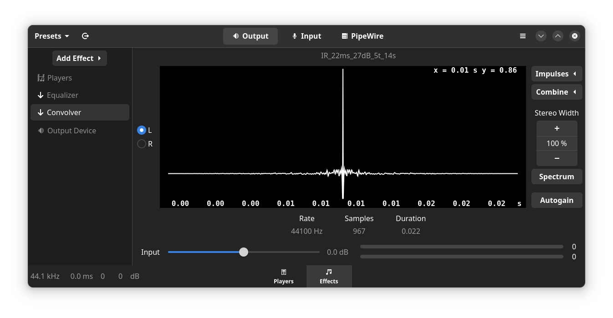

We go back to the spectrum measurement and store the uncorrected
spectrum with the "Store" button (to compare with later measurements).
More measurements can be stored as well, for example where the microphone
is placed in different locatations, The total average of the stored
measurements is shown in orange

Measuring the equalized system gives this:

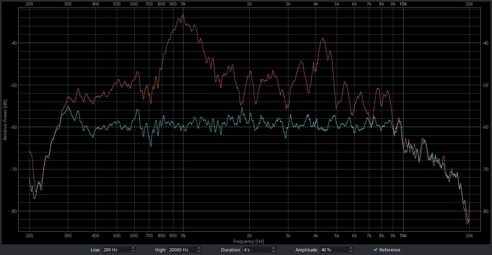

It is seen that the equalization works by attenuation only:
Everything gets chopped to some level under the top (27 dB here)
and this flattens the whole landscape.

All this attenuation does decrease the total loudness, so the
volume has to be turned up to get the same loudness. This also
brings up the flanks of the spectrum and increases the effective
frequency range. There's a very welcome 40 Hz of extra bass and
a whole lot of treble:

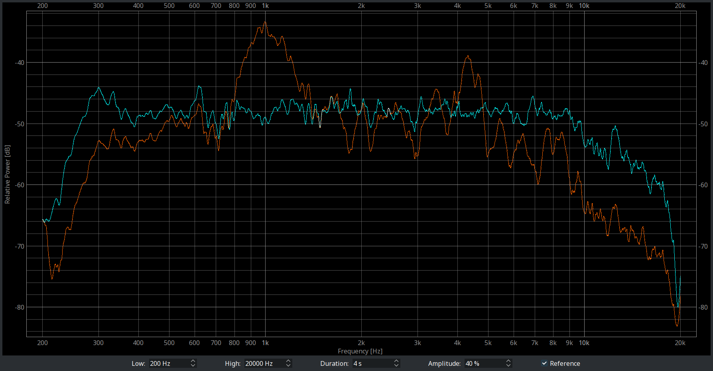

This is the point to leave the graphs and start to listen to
some music. Is there an improvement? There are of course lots
of different tastes in what sounds good, but for those who like
a neutrally balanced sound there is a huge improvement. Voices
are also much easier to understand.

The lack of bass is somewhat offset by the
`missing fundamental <https://en.wikipedia.org/wiki/Missing_fundamental>`_
phenomenon, were the brain "adds" a missing low frequency based on
its higher frequency harmonics. It seems that by equalizing the
harmonics the phantom bass gets equalized as well.

HiFi Stereo
-----------

The HiFi installation has four JBL surround loudspeakers wired
in series as a 2x2 stereo setup, plus a subwoofer. The sound
can only be described as very dull, as if the tweeters are
not working.

To calibrate we use the same microphone as for the laptop,
which is a Superlux E205UMKII.
Lets this time correct for any non-flatness of the microphone.
According to the documentation
it has this frequency response:

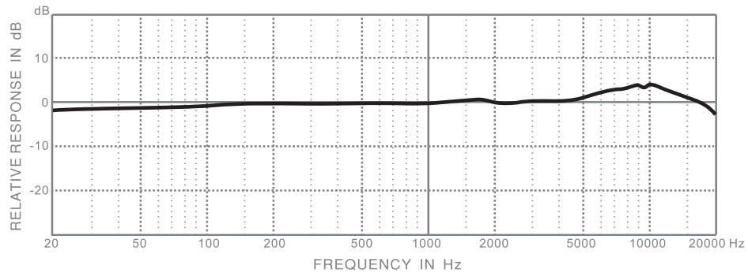

We create a text file that describes the microphone's frequency response::

  20 -1.5
  150 0
  4500 0
  10000 4
  17000 0
  20000 -2

The file is imported with "Corrections... -> Mic Calibration -> Load".
Manifucturer-supplied calibration files can be imported here as well.

Measuring the spectrum bears out the concerning lack
of treble:

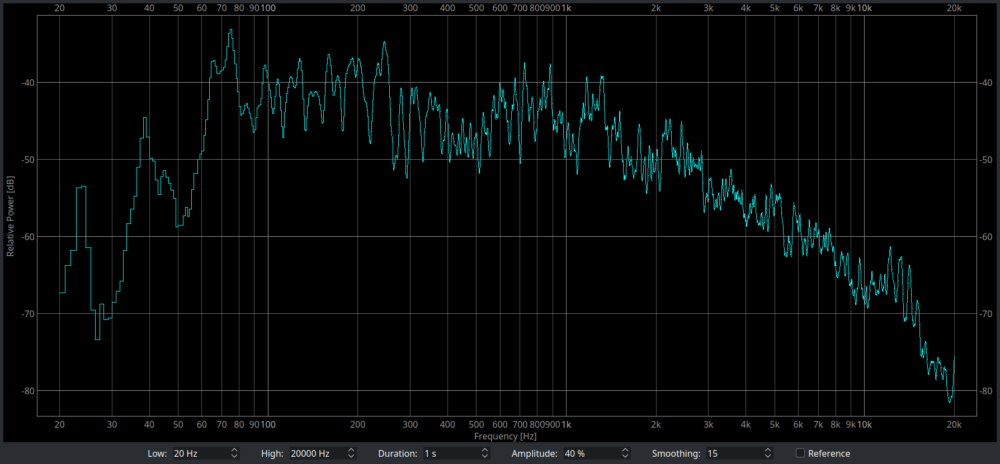

So lets go to the Impulse Response section to fix this.

The **Range** is set to 33 dB - this is an extreme value but what the heck.

The **Tapering** is left at 5. It pulls the flanks of the Impulse
Response closer to zero (visible in the green curve), which also has
a smoothing effect on the spectrum. A value less than 5 might leave
the flanks of the green curve too high and this can cause nasty
`pre-echos <https://en.wikipedia.org/wiki/Pre-echo>`_.
A value higher than 5 might cause too much smoothing of the bass
region.

The **Smoothing** will also smooth the spectrum, but the smoothing is
done proportional to the frequency. It will smooth the bass region
less, allowing for better precision there. A good smoothing value
can be judged from the Correction Factor graph (in red): It should
be smooth with nicely rounded corners, yet with enough detail.

The **Duration** is fiddled with until an acceptable bass response is
reached (visible in lowest graph in brown).

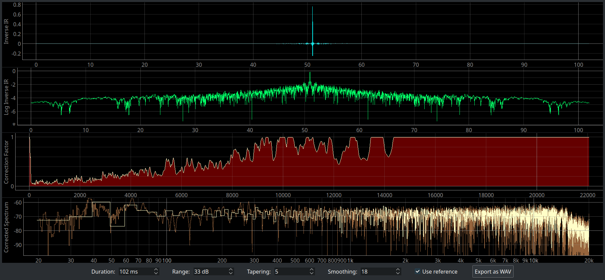

After exporting the Impulse Response and importing it into
EasyEffects the result looks promising.

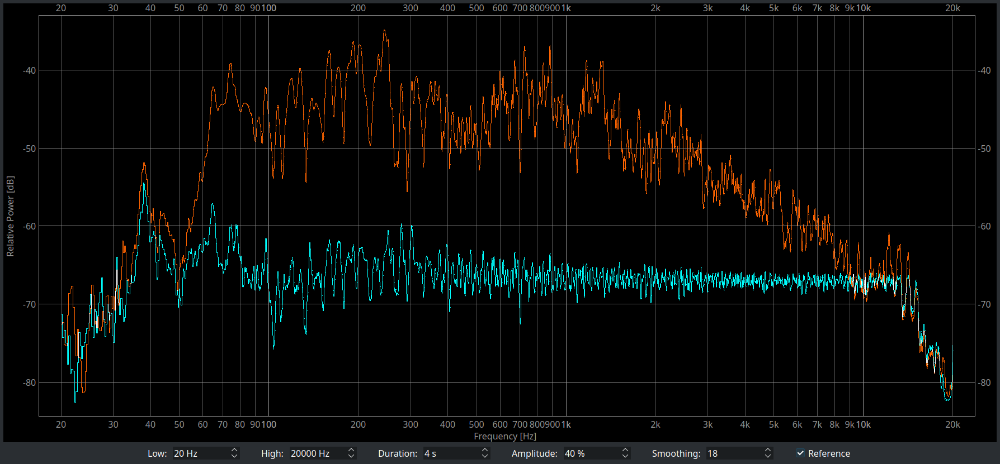

We turn up the volume to get the same loudness as before and
apply some visual smoothing to the spectrum for clarity.
It turns out that the tweeters can
do their job if only the amplifier drives them 100 times as hard.

.. image:: images/stereo-final.png

The difference in sound quality is night and day. Music is really
really good now. For movies it brings very immersive
action and excellent clarity of dialogue.

As mentioned in the introduction, the equalization is phase-
neutral. This means that despite the heavy and steep equalization
there are no relative phase shifts added. The details in a
lossless source of music (such as the bounces of a cymbal)
remain as crisp as can be.

As an aside, the amplifier used is a $18 circuit board based on the
`TPA3116D2 digital amplifier chip <https://www.ti.com/product/TPA3116D2>`_.
It draws 1.1 Watt while playing which only increases if the subwoofer
is really busy.

Bluetooth headphones
--------------------

HiFiScan is not intended for use with headphones. There is
the
`AutoEq project <https://github.com/jaakkopasanen/AutoEq>`_
with ready-made corrections for most headphones, Even so,
it can be used for experiments. For example, I have very
nice Dali IO-4 headphones that can be used with Bluetooth
or passively with an analog audio cable. It sounds better with
Bluetooth, which suggests that some equalization
is taking place. Lets measure this!

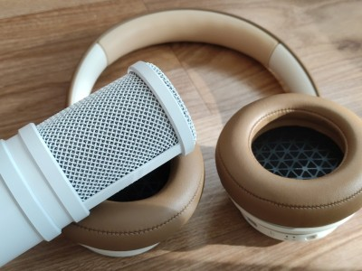

It is seen that there is a indeed a bit of active tuning
going on, although most of the tuning is done acoustically.
In orange is bluetooth and in cyan is the analog cable.
There's a wide -10dB attenuation at 1.8 kHz and a narrow -4dB one at 5.5 kHz.
This tuning can be applied to the analog signal to get the same sound as
with Bluetooth.

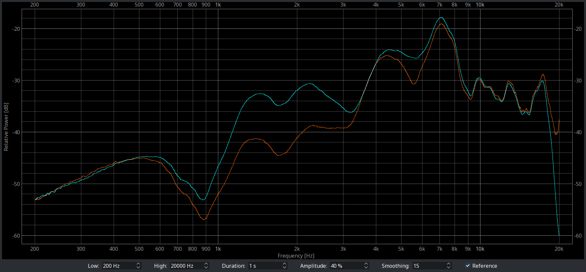

Using a target curve
--------------------

Instead of aiming for a flat spectrum, it's also possible to target
a specific curve. This is done by creating a text file with the target
curve and importing it with "Corrections... -> Target Curve -> Load".
Lets use this zig-zagging target curve::

  300 -10
  500 10
  1000 5
  2000 10
  4000 10
  6000 0
  20000 -10

In the Impulse Response section we see in the lower graph that
a fit is made to the red line, which is the target curve.

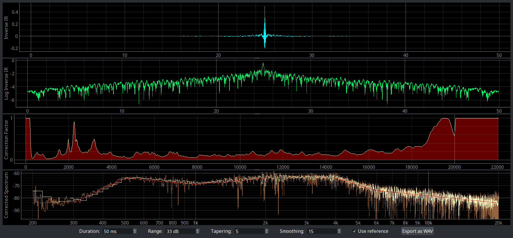

The impulse with the baked-in target spectrum is exported and imported
into EasyEffects. In orange is the original spectrum, in red is the target
and in cyan the reshaped spectrum that tries to follow the target curve:

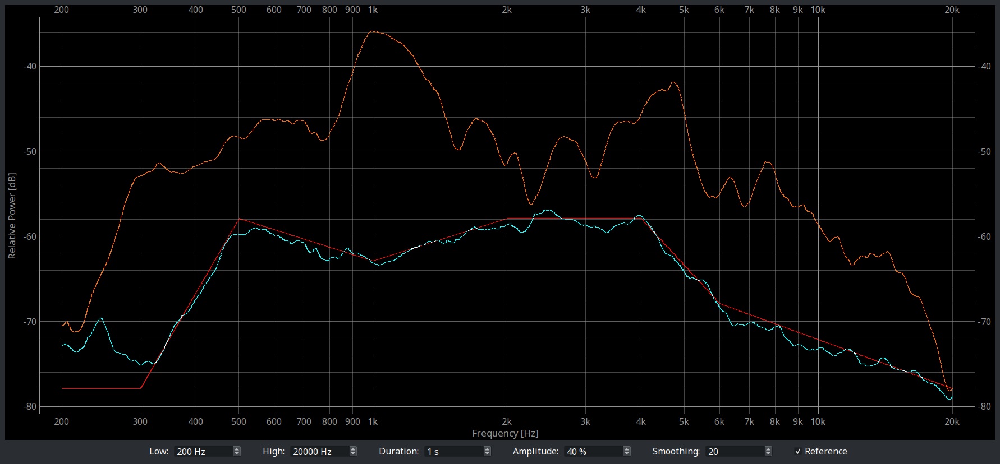

.. |PyPiVersion| image:: https://img.shields.io/pypi/v/hifiscan.svg
   :alt: PyPi
   :target: https://pypi.python.org/pypi/hifiscan

.. |PyVersion| image:: https://img.shields.io/badge/python-3.8+-blue.svg
   :alt:

.. |Status| image:: https://img.shields.io/badge/status-stable-green.svg
   :alt:

.. |License| image:: https://img.shields.io/badge/license-BSD-blue.svg
   :alt:

Disclaimer
==========

The software is provided on the conditions of the simplified BSD license.
Any blown speakers or shattered glasses are on you.

Enjoy,

:author: Ewald de Wit <ewald.de.wit@gmail.com>
